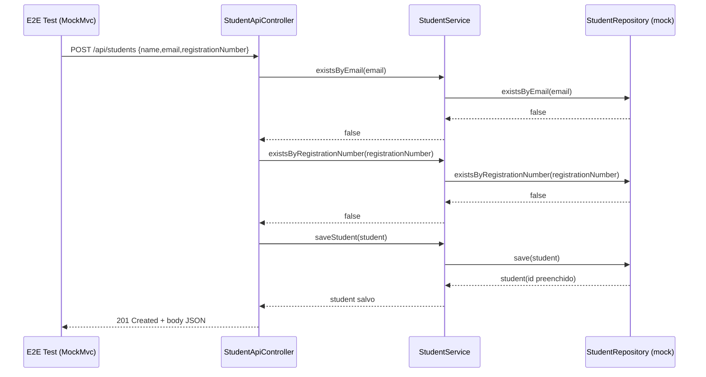
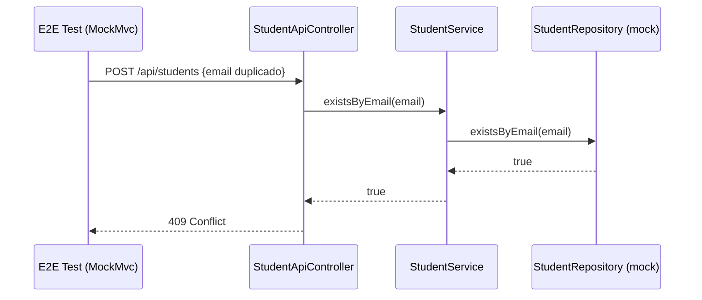
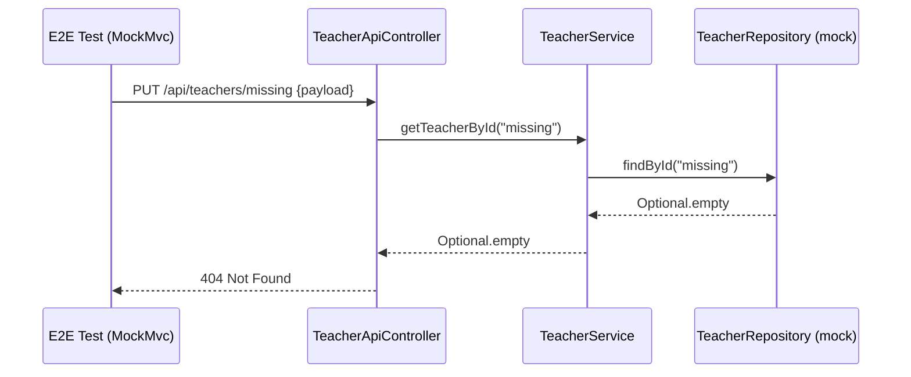
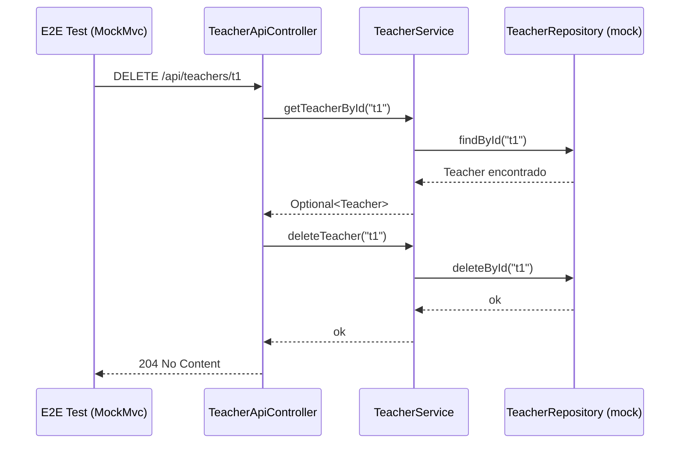

# Diagramas UML de Sequencia - Testes End-to-End

Este documento descreve os fluxos E2E cobertos pelos testes em:
- `src/test/java/com/example/educationalqualityproject/e2e/StudentApiE2ETest.java`
- `src/test/java/com/example/educationalqualityproject/e2e/TeacherApiE2ETest.java`

## 1. Criacao de Student com sucesso (`POST /api/students`)

## 2. Conflito de Student por email duplicado (`POST /api/students`)

## 3. Atualizacao de Teacher inexistente (`PUT /api/teachers/{id}`)

## 4. Exclusao de Teacher com sucesso (`DELETE /api/teachers/{id}`)

