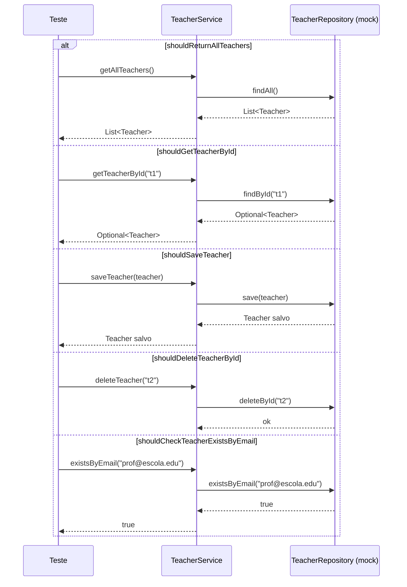
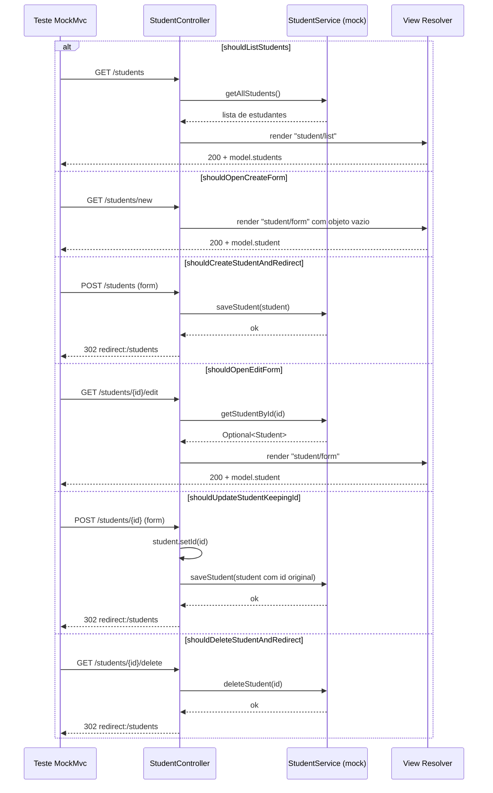
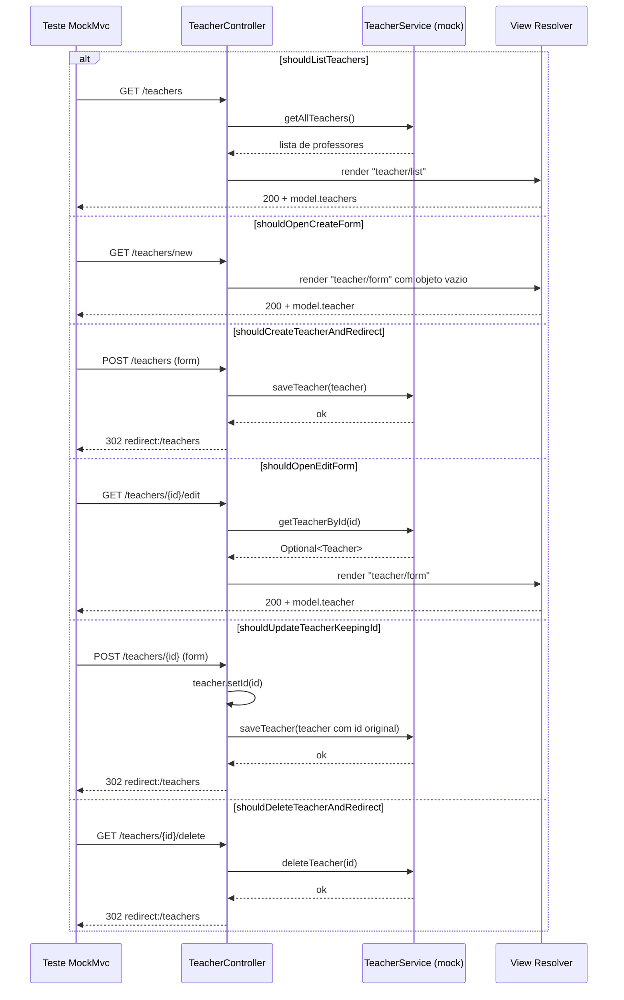
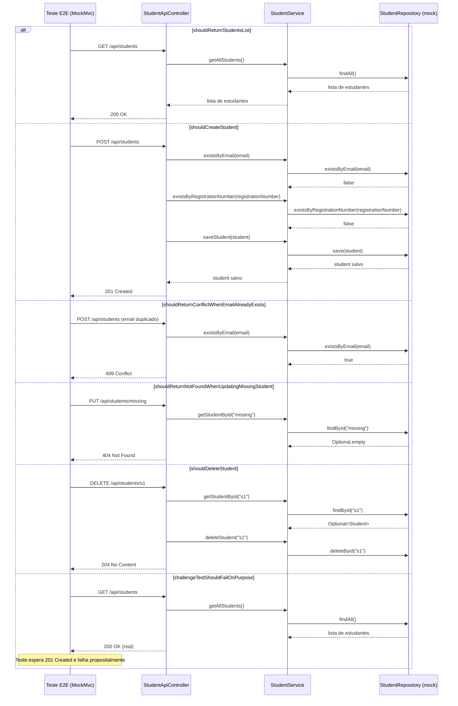
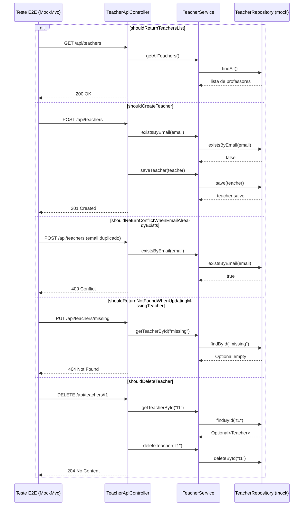

# UML de Sequencia dos Testes Criados

Este documento consolida os fluxos de sequencia da aplicacao exercitados pelos testes criados recentemente:
- `TeacherServiceTest`
- `StudentControllerTest`
- `TeacherControllerTest`
- `StudentApiE2ETest`
- `TeacherApiE2ETest`

## 1) TeacherServiceTest

## 2) StudentControllerTest

## 3) TeacherControllerTest

## 4) StudentApiE2ETest

## 5) TeacherApiE2ETest

## Alternativa: PlantUML (site)

Voce tambem pode renderizar os mesmos fluxos usando PlantUML no site oficial:

1. Acesse `https://www.plantuml.com/plantuml/uml/`.
2. Converta o fluxo para sintaxe PlantUML entre `@startuml` e `@enduml`.
3. Clique em `Submit`.
4. Baixe a imagem (PNG/SVG) e salve no projeto (ex.: `docs/uml/`).
